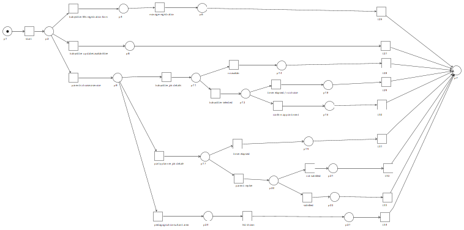

# Babies360

We want to model the service offered by an agency specialized in providing services to new parents. The company relies on the services offered by professionals such as babysitters, pedagogical consultants and event organizers.
Based on the requests of the parents the agency help them by coordinating the communication with other service providers.

## Members:
* Francesca Grimaldi, 10744925
* Matteo Fiorentino, 10686260
* Gabriele Lazzarelli, 10623766

# Third party services
* baby sitters
* party organizer
* pedagogical consultant

In our design, the parents query babies360 for the available service, then if interested they can choose a service.
Each service request has a different set of parameters based on the type of service requested, e.g. the `date` and `time` and for how many `hours` in case of the babysitter request.

Each service provision differs from one another:
- the **babysitting service** takes place in the babies360 platform from start to finish, the parents decide which babysitter they prefer from the available ones and the payment has to take place within one day from the selection in order to confirm the appointment.
- in the **party planner service** the parents decides only which type of services (among "party services", e.g., catering) they will need, then a party planner will search the suitable options for each category and will report back to babies360 that will forwars the proposals to the parents. If the proposal is accepted the plan is confirmed and the payment will be deducted after the party.
- for the **consultant service** babies360 acts only as a professional search portal, in this case the value is gained from the consultants which pay a fee for each appointment they make thanks to the babies360 platform.

## Choreographed process

## Collaboration Diagram

## Executable process

## Petri Net

[PDF version](processes/petrinet.pdf)
